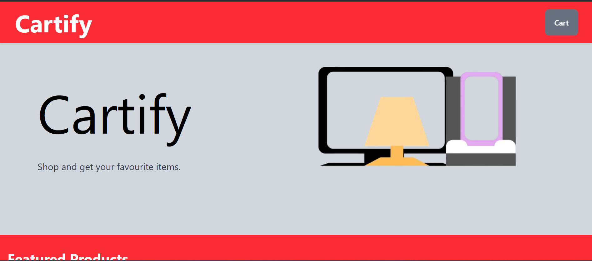
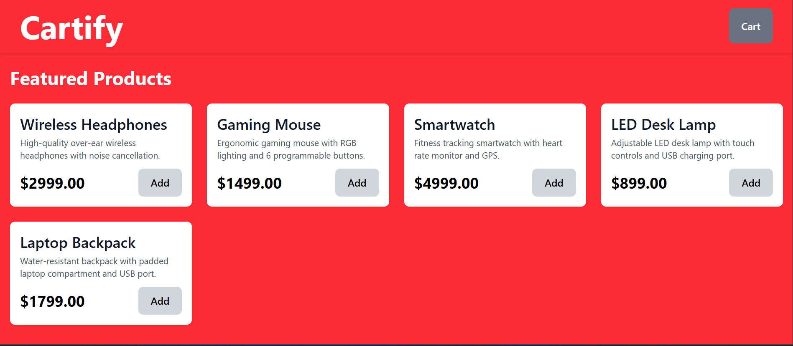
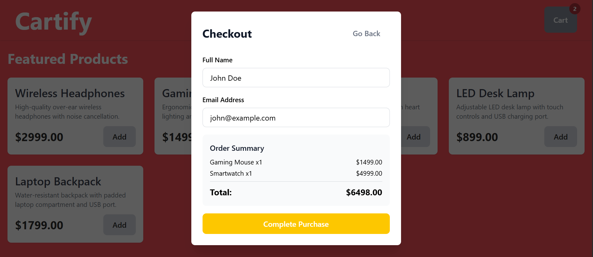

# Cartify - Full Stack E-Commerce Cart

A modern, full-stack shopping cart application built with React, Node.js/Express, and MongoDB. Features real-time cart management, mock checkout process, and responsive design.


## Features

### Frontend (React)

- Product grid display with 10 mock products
- Add to cart functionality with real-time updates
- Shopping cart sidebar with item management
- Quantity adjustment (increment/decrement)
- Remove items from cart
- Real-time total calculation
- Checkout form with validation
- Order confirmation receipt modal
- Fully responsive design
- Error handling with user feedback
- Loading states for async operations

### Backend (Node.js/Express)

- RESTful API endpoints
- MongoDB database integration
- CRUD operations for cart management
- Mock checkout with order persistence
- Auto-calculate cart totals
- Error handling middleware
- CORS enabled for frontend communication

## Tech Stack

**Frontend:**

- React 18
- TailwindCSS (via inline classes)
- Fetch API for HTTP requests

**Backend:**

- Node.js
- Express.js
- MongoDB with Mongoose
- UUID for order IDs
- CORS

## Prerequisites

- Node.js (v16 or higher)
- MongoDB (local or Atlas)
- npm or yarn

## Installation & Setup

### 1. Clone the Repository

```bash
git clone https://github.com/Nihaar75858/cartify.git
cd cartify
```

### 2. Backend Setup

```bash
# Navigate to backend directory
cd backend

# Install dependencies
npm install

# Create .env file
cat > .env << EOF
PORT=5000
MONGODB_URI=mongodb://localhost:27017/cartify
NODE_ENV=development

# Start the backend server
npm run dev
```

The backend will run on `http://localhost:5000`

### 3. Frontend Setup

```bash
# Navigate to frontend directory (from root)
cd ../frontend

# Install dependencies
npm install

# Create .env file (if needed)
echo "VITE_API_URL=http://localhost:5000/api" > .env

# Start development server
npm run dev
```

The frontend will run on `http://localhost:5173` or `http://localhost:3000`

### 4. Access the Application

Open your browser and navigate to:

```
http://localhost:5173
```

## API Endpoints

### Products

**GET** `/api/products`

- Get all products
- Response: Array of product objects

```json
[
  {
    "_id": "...",
    "name": "Wireless Headphones",
    "description": "Premium noise-canceling Headphones",
    "price": 129.99,
    "category": "Electronics",
    "inStock": true
  }
]
```

### Cart

**POST** `/api/cart`

- Add item to cart
- Body:

```json
{
  "productId": "product_id_here",
  "quantity": 1
}
```

**GET** `/api/cart`

- Get current cart with items and total
- Response:

```json
{
  "items": [
    {
      "_id": "...",
      "product": {
        "_id": "...",
        "name": "Wireless Headphones",
        "price": 129.99
      },
      "quantity": 2
    }
  ],
  "total": 259.98
}
```

**PUT** `/api/cart/:id`

- Update cart item quantity
- Body:

```json
{
  "quantity": 3
}
```

**DELETE** `/api/cart/:id`

- Remove item from cart
- Response: Updated cart

### Checkout

**POST** `/api/checkout`

- Process checkout and create order
- Body:

```json
{
  "cartItems": [...],
  "customerInfo": {
    "name": "John Doe",
    "email": "john@example.com"
  }
}
```

- Response:

```json
{
  "orderId": "A1B2C3D4",
  "customerInfo": {
    "name": "John Doe",
    "email": "john@example.com"
  },
  "items": [...],
  "total": 259.98,
  "timestamp": "2024-01-15T10:30:00.000Z",
  "message": "Order placed successfully!"
}
```

## Project Structure

```
vibe-commerce/
│
├── backend/
│   ├── server.js              # Express server setup
│   ├── package.json
│   ├── .env
│   ├── models/
│   │   ├── Product.js         # Product schema
│   │   ├── Cart.js            # Cart schema
│   │   └── Order.js           # Order schema
│   └── routes/
│       ├── products.js        # Product routes
│       ├── cart.js            # Cart routes
│       └── checkout.js        # Checkout routes
│
├── frontend/
│   ├── src/
│   │   ├── pages/
│   │   |   └── Cartify.jsx
│   │   ├── App.jsx            # Main React component
│   │   ├── main.jsx
│   │   └── index.css
│   ├── package.json
│   ├── vite.config.js
│   └── index.html
│
└── README.md
```

## How to Use

### 1. Browse Products

- View 10 available products on the home page
- See product name, description, and price

### 2. Add to Cart

- Click "Add" button on any product
- Item quantity badge updates in cart icon

### 3. Manage Cart

- Click cart icon to view cart sidebar
- Adjust quantities with +/- buttons
- Remove items with trash icon
- View real-time total

### 4. Checkout

- Click "Proceed to Checkout"
- Fill in name and email
- Review order summary
- Click "Complete Purchase"

### 5. View Receipt

- See order confirmation with unique order ID
- View purchased items and total
- Order is saved to database

## Testing the API

### Using Postman

Import the following collection:

```json
{
  "info": {
    "name": "Cartify API",
    "schema": "https://schema.getpostman.com/json/collection/v2.1.0/collection.json"
  },
  "item": [
    {
      "name": "Get Products",
      "request": {
        "method": "GET",
        "url": "http://localhost:5000/api/products"
      }
    },
    {
      "name": "Add to Cart",
      "request": {
        "method": "POST",
        "url": "http://localhost:5000/api/cart",
        "body": {
          "mode": "raw",
          "raw": "{\"productId\":\"...\",\"quantity\":1}"
        }
      }
    }
  ]
}
```

## Screenshots

### Home Page - Products Grid

 



### Shopping Cart Sidebar


### Checkout Modal



### Order Confirmation


## 🎥 Demo Video

[Watch Demo Video](https://www.loom.com/share/cec2c0b8a52647ddaec6346114ff4e29)

_2-minute walkthrough of features_

## Bonus Features Implemented

- **Database Persistence**: All cart and order data persisted in MongoDB
- **Error Handling**: Comprehensive error handling on both frontend and backend
- **Auto-calculate Totals**: Cart totals calculated automatically using Mongoose pre-save hooks
- **Responsive Design**: Works on mobile, tablet, and desktop
- **Loading States**: Visual feedback during async operations
- **Form Validation**: Email and name validation on checkout
- **Real-time Updates**: Cart updates immediately without page refresh

## Dependencies

### Backend

```json
{
  "cors": "^2.8.5",
  "dotenv": "^17.2.3",
  "express": "^5.1.0",
  "mongoose": "^8.19.3",
  "uuid": "^8.3.2"
}
```

### Frontend

```json
{
  "@tailwindcss/vite": "^4.1.17",
  "react": "^19.1.1",
  "react-dom": "^19.1.1",
  "react-router-dom": "^7.9.5",
  "tailwindcss": "^4.1.17"
}
```

## Author

**Nihaar Mascarenhas**

- GitHub: [@Nihaar75858](https://github.com/Nihaar75858)
- LinkedIn: [nihaar-mascarenhas](https://www.linkedin.com/in/nihaar-mascarenhas/)
- Email: nihar.adhiep@gmail.com

---

**Note**: This is a mock e-commerce project for demonstration purposes. No real payments are processed.
